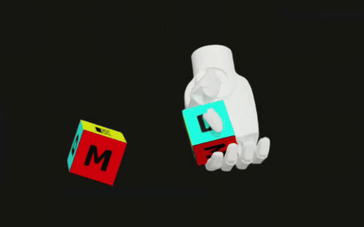

# LinkerHand IsaacLab Patch

LinkerHand 在 IsaacLab 中的任务适配补丁仓库，当前聚焦 `manager_based/manipulation/inhand` 任务，覆盖 `L20`、`L20Lite`、`O6` 三套手型。

项目目标不是提供完整 IsaacLab 分叉，而是沉淀一组可复制到主 IsaacLab 工程中的资产配置、任务配置和手型专用驱动逻辑。

这个仓库主要做了下面几件事：

- 在 `isaaclab_assets` 下补齐 LinkerHand 机器人资产导出入口
- 在 `manager_based/manipulation/inhand` 下补齐 `L20`、`L20Lite`、`O6` 的任务配置与注册入口
- 将 `L20` 的 mimic 处理从 IsaacLab core patch 迁移到任务侧 `mdp` 动作层
- 为 `L20`、`L20Lite`、`O6` 补齐各自的 agent 配置入口
- 增加最小单元测试，验证软件侧 mimic 规则的张量写回逻辑

个人工作追踪： [CHANGELOG.md](CHANGELOG.md)。

## 项目内容

- LinkerHand 机器人配置导出
- `inhand` 任务下的 `L20` / `L20Lite` / `O6` 适配配置
- `L20` 所需的软件侧 mimic 动作层
- 最小规则测试与补丁说明

### o6 hand demo

### l20 hand demo

## 目录结构

- `source/isaaclab_assets`
  - LinkerHand 机器人配置与资产入口
- `source/isaaclab_tasks`
  - `inhand` 任务配置、注册入口和 Linker 专用动作层
- `demo`
  - README 中使用的演示 GIF 与原始 MP4
- `tests`
  - 轻量规则测试
- `scrpts`
  - 当前保留的训练/播放实验脚本，便于本仓库单独联调，不作为长期权威入口

## 如何使用

这个仓库本身不是完整 IsaacLab，可运行部分依赖完整 IsaacLab 工程。

推荐用法是将本仓库的 `source/` 内容按相对路径添加到完整 IsaacLab 仓库：

- `source/isaaclab_assets` -> `<IsaacLab>/source/isaaclab_assets`
- `source/isaaclab_tasks` -> `<IsaacLab>/source/isaaclab_tasks`

LinkerHand 资产目录固定为：

`<IsaacLab>/source/isaaclab_assets/isaaclab_assets/robots/linker/`

需要存在以下 USD 文件：

- `l20_right.usd`
- `l20lite_no_mimic.usd`
- `o6_hand.usd`

当前仓库不包含这三份 USD，本仓库只保存代码侧补丁。***获取 USD 时，导入 URDF 需要选择 `ignore mimic`，然后保存为 flattened USD。***

如果只把这个仓库单独拉下来而不放进完整 IsaacLab，任务注册、训练脚本依赖和官方 workflow 入口都不会完整。

## 任务列表

- `Isaac-Repose-Cube-L20-v0`
- `Isaac-Repose-Cube-L20-Play-v0`
- `Isaac-Repose-Cube-L20Lite-v0`
- `Isaac-Repose-Cube-L20Lite-Play-v0`
- `Isaac-Repose-Cube-O6-v0`
- `Isaac-Repose-Cube-O6-Play-v0`

### 在完整 IsaacLab 中运行

- 先把本仓库的 `source/` 覆盖到完整 IsaacLab
- 再使用该 IsaacLab 版本原本自带的 RSL-RL `train.py` / `play.py`
- 任务名直接用下面这些注册好的 task id

训练 task：

- `Isaac-Repose-Cube-L20-v0`
- `Isaac-Repose-Cube-L20Lite-v0`
- `Isaac-Repose-Cube-O6-v0`

播放 task：

- `Isaac-Repose-Cube-L20-Play-v0`
- `Isaac-Repose-Cube-L20Lite-Play-v0`
- `Isaac-Repose-Cube-O6-Play-v0`

## 当前状态与说明

- `L20`
  - 已保留当前实验参数
  - 使用任务侧 `LinkerMimicEMAJointPositionToLimitsActionCfg`
  - 已知放入完整 IsaacLab 后可训练
- `L20Lite`
  - 已整理为显式 active joints 驱动
  - 仍需要在完整 IsaacLab 中重新 smoke-test
- `O6`
  - 已补齐任务注册和 agent 命名
  - 仍需要在完整 IsaacLab 中重新 smoke-test

本仓库只提供 LinkerHand 在 IsaacLab `inhand` 任务下的代码侧适配补丁，不包含完整 IsaacLab、训练权重或手型 USD 资产（可以参考上面的方法），也不保证脱离完整 IsaacLab 工作区即可直接运行。

本仓库内容仅供学术交流与研究参考使用。

LinkerHand 相关公开参考仓库：

- [https://github.com/linker-bot/linkerhand-urdf](https://github.com/linker-bot/linkerhand-urdf)
